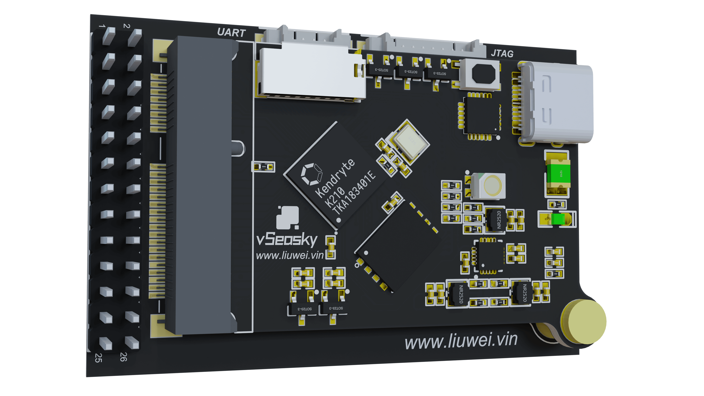
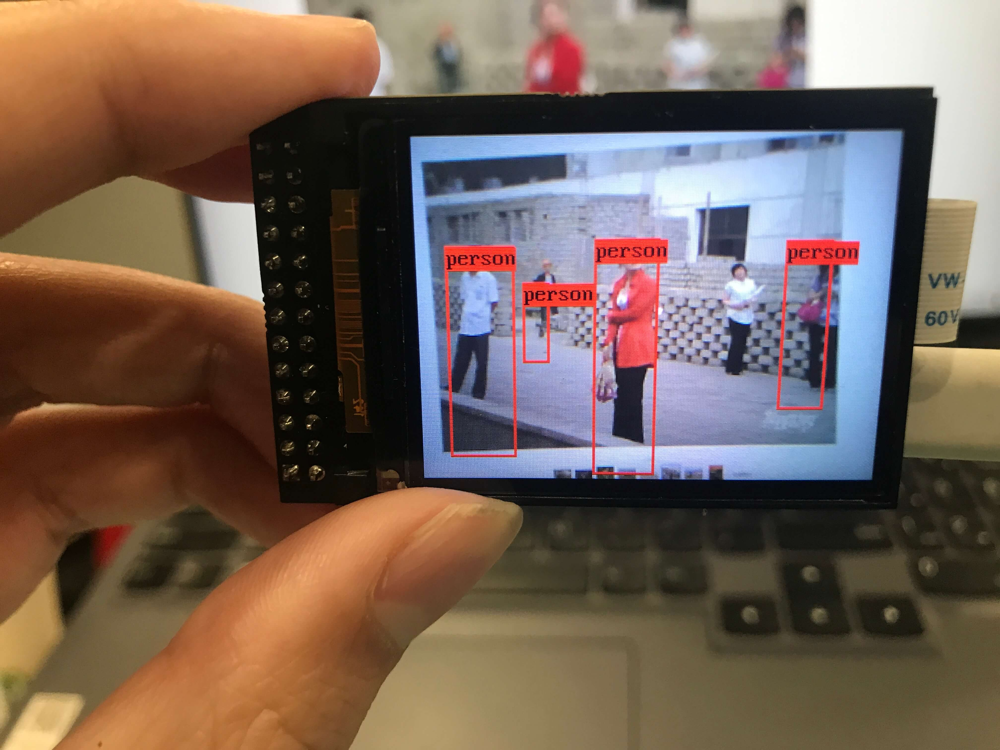
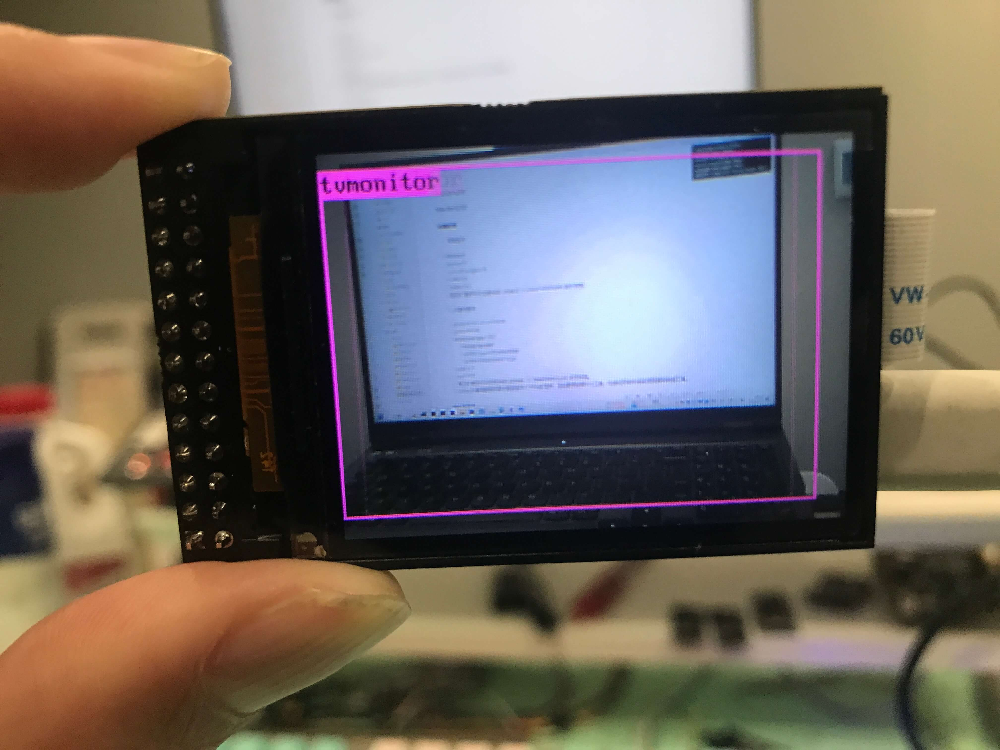

## 教程

[riscv-k210](https://docs.liuwei.vin/notes/riscv-k210/)

## 实物图片








## 支持

- 硬件原理图，工程文件等
- 支持官方SDK（基于C语言）
- 支持MaixPy（基于Micropython）
- 支持CanMv（基于Micropython）
- 拥有yolo的详细案例

## Windows 命令行开发环境搭建

1. 下载 [Cmake V3.0](https://cmake.org/download/) 之后的 *Windows* 版本，把 *cmake* 安装到 `D:\cmake` 目录，并把 D:\cmake\bin 目录添加到 *PATH* 环境变量。


2. 打开一个新的 *cmd* 窗口，输入` cmake --version` 命令，若看到如下信息说明设置正确。


3. 从 [kendryte-gnu-toolchain](https://github.com/kendryte/kendryte-gnu-toolchain/releases ) 下载 *Windows* 版本工具链。 打开网页后展开 *Assets* 可看到下载链接。


4. 配置环境变量


5. 重新打开一个 *cmd* 窗口，输入 `riscv64-unknown-elf-gcc -v` 命令，看到如下信息说明编译器设置正确。


6. 同时你还需要安装 *win* 下 *cmake* 依赖的编译工具、否则你将无法使用 *make* ，因此你还需要安装  [MingW](https://sourceforge.net/projects/mingw-w64/files/mingw-w64/mingw-w64-release/)


- 选择 gcc 版本

Version 指的是 gcc 的版本，如果没有特殊的需求，一般选择最高的版本号即可。

- 选择电脑系统架构

Architecture 是指电脑系统是 32位 还是 64位，根据你的电脑系统做出对应选择。我的电脑系统是 64位 的，所以我选择了 x86_64，如果你是 32位 系统，则选择 i686 即可。

- 选择操作系统接口协议

这个世界上只有两种操作系统，符合 posix 协议的，和 Windows 。如这个笑话所说的，如果你想要开发 Windows 程序，需要选择 win32 ，而开发 Linux、Unix、Mac OS 等其他操作系统下的程序，则需要选择 posix 。

- 选择异常处理模型（64位）

异常处理在开发中非常重要，你在开发的过程中，大部分的时间会耗在处理各种异常情况上。如果你之前选择了 64位，则这里有两个异常处理模型供你选择，seh 是新发明的，而 sjlj 则是古老的。seh 性能比较好，但不支持 32位。 sjlj 稳定性好，支持 32位。我这里选择了 seh 。

- 选择异常处理模型（32位）

说明：选择了 32位 后，则可以用 dwarf 和 sjlj 两种异常处理模型。同样的，dwarf 的性能要优于 sjlj ，可它不支持 64位 。操作：建议选择 dwarf 。

7. 如果在线安装失败，可以选择对应版本直接下载，同时手动添加环境变量。


8. 安装命令行版本烧录固件工具

```bash
pip3 install kflash
```

## VSCode源码编译（Windows）

注意：开始之前你需要删除 build 目录，同理如果你将完整的正常的代码复制到其他目录，然后重新编译，也需要先删除 build 目录

1. 用`VSCode`打开项目源码，并启动终端窗口
2. `cd` 到源码目录
3. 使用`mkdir build`创建目录
4. 使用`cd build`跳转到`build`目录


5. 运行cmake

```bash
cmake .. -DPROJ=k210-yolo -G "MinGW Makefiles"
```


输出以下结果为正常


6. 在build目录下编译

```bash
make -j
```


7. 使用命令行版本直接进行下载

```bash
kflash -p COM3 -b 2000000 -B bit .\k210-yolo.bin
```


## 提供对 [Maixpy](https://wiki.sipeed.com/soft/maixpy/zh/) 的支持

烧录 support 目录下的 maixpy 固件

具体使用方式参考 maixpy 官网


## 提供对 [CanMV](https://developer.canaan-creative.com/static/canmv/get-start/quick-start.html) 的支持

烧录 support 目录下的 canmv 固件

具体使用方式参考 canmv 官网