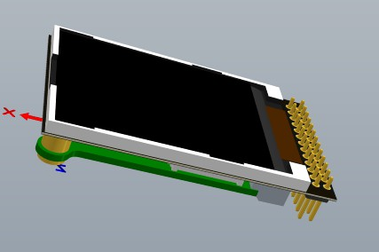
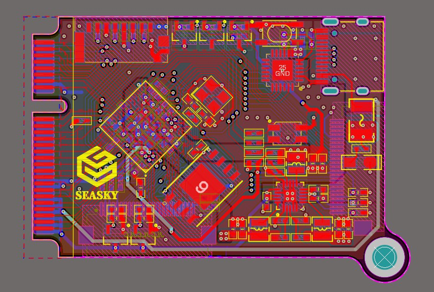
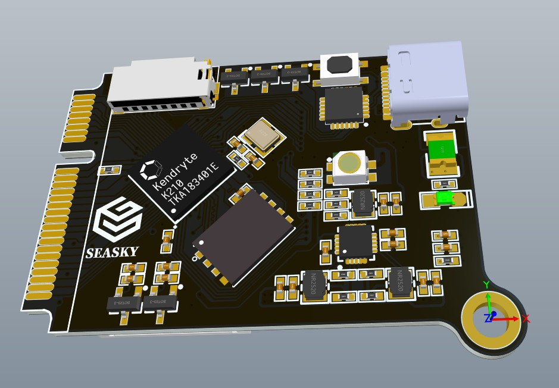
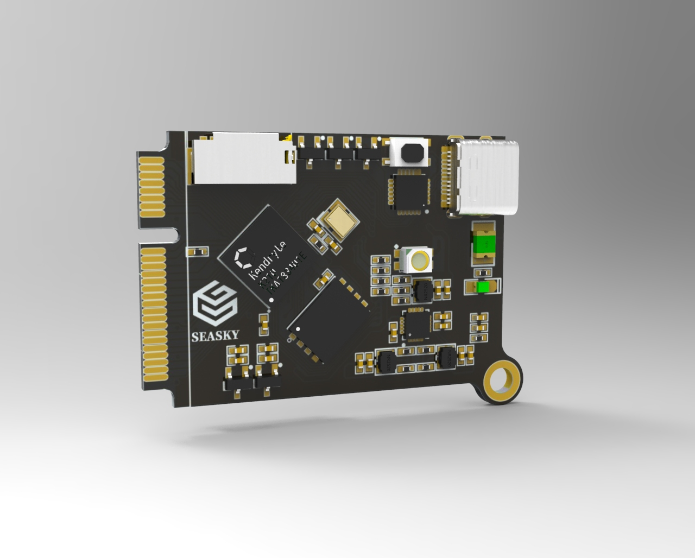
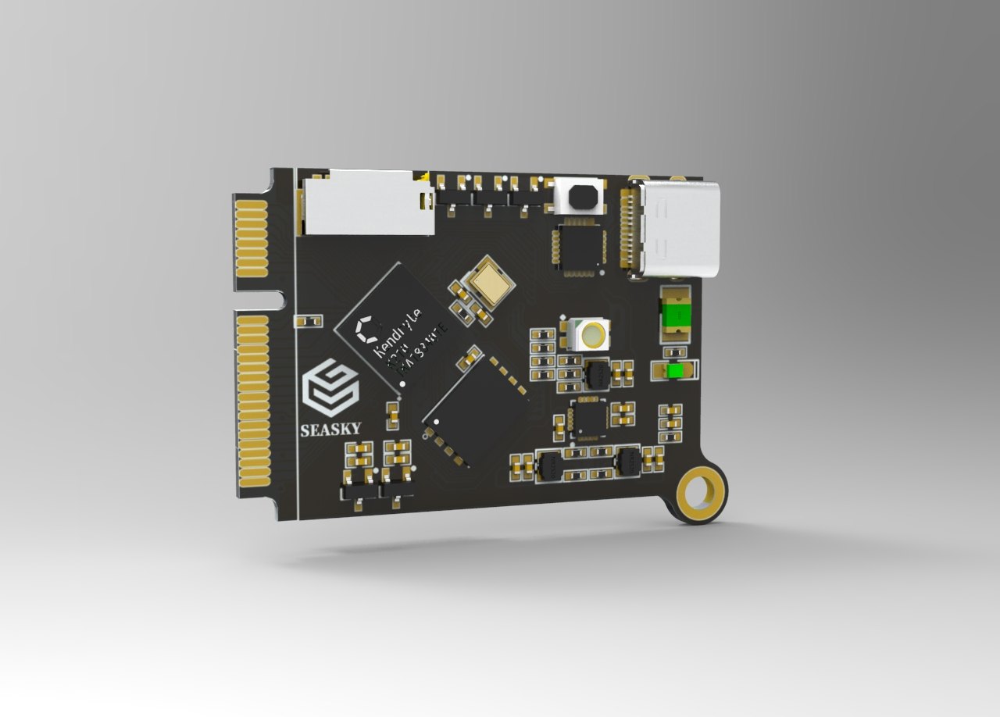

**@版权所有->SEASKY**

**LICENSE:** **MIT License**

**B站视频[https://b23.tv/Yrvqdr](https://b23.tv/Yrvqdr)**

**最终演示视频[https://b23.tv/My8G7x](https://b23.tv/My8G7x)**

**简介**：

- **硬件 K210+128M spi Flash+OV2640+LCD**
- **其他介绍可以百度了解，我这里附上稚晖的介绍链接[https://zhuanlan.zhihu.com/p/81969854](https://zhuanlan.zhihu.com/p/81969854)**
- **简单说明在深度学习图像识别方面，他比树莓派强，而其成本不超过100元，淘宝也可以买到其他不错的k210开发板**
- **注意核心板部分打板需要1mm板厚，不要打1.6mm板厚的**

## yolo模型训练以及部署参考<a href="https://github.com/SEASKY-Master/Yolo-for-k210">https://github.com/SEASKY-Master/Yolo-for-k210</a>

- win上完整的YOLO训练以及官方SDK开发流程

