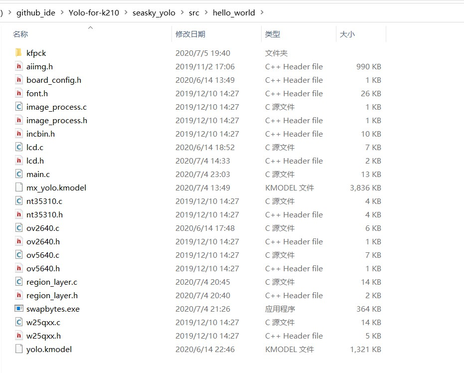
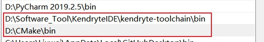
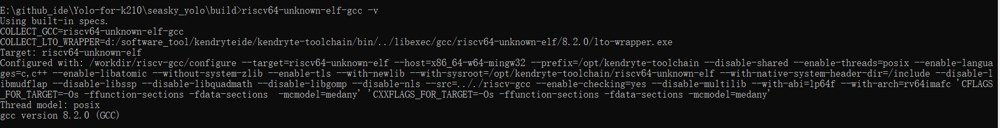
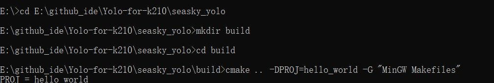
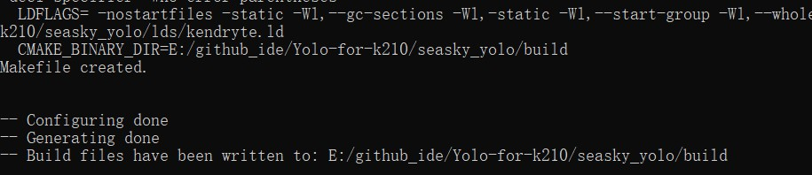
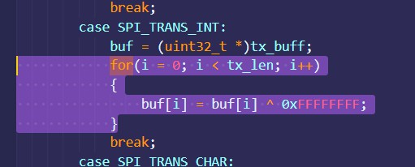

# SEASKY-K210-YOLO-DEMO

### **@版权所有->刘威**

### **LICENSE:** **MIT License**

### 个人博客：<a href="https://seasky-master.github.io/SEASKY-Master/">https://seasky-master.github.io/SEASKY-Master/</a>

代码基于`Kendryte K210 standalone SDK`开发、有修改 SDK 中部分代码。

除 SDK 外的代码位于`xx/src/hello_world`,如果你需要使用自己的代码可以删除 hello_world 目录下的代码，然后将自己代码复制到该目录。

下面开始进入正题

## 硬件设计

- <a href="https://github.com/SEASKY-Master/SEASKY_K210">SEASKY-K210</a>

  
  
  

## Windows 命令行开发环境搭建

1. 下载 <a href="https://cmake.org/download/">cmake V3.0</a>之后的 Windows 版本，把 cmake 安装到 D:\cmake 目录，并把 D:\cmake\bin 目录添加到 PATH 环境变量。
2. 打开一个新的 cmd 窗口，输入 `cmake –version` 命令，若看到如下信息说明设置正确。
   

3. 从<a href="https://github.com/kendryte/kendryte-gnu-toolchain/releases">Kendryte Github</a>下载 Windows 版本工具链。 打开网页后展开 Assets 可看到下载链接。
   

4) 配置环境变量
   

5) 重新打开一个 cmd 窗口，输入 `riscv64-unknown-elf-gcc –v`命令，看到如下信息说明编译器设置正确。
   
   到此开发环境搭建完成

## 源码编译（win）

注意：开始之前你需要删除 build 目录，同理如果你将完整的正常的代码复制到其他目录，然后重新编译，也需要先删除 build 目录

1.  打开 cmd 窗口
2.  cd 到源码目录
3.  使用`mkdir build`创建目录
4.  使用`cd build`跳转到`build`目录
5.  运行`cmake`

        cmake .. –DPROJ=hello_world –G “MinGW Makefiles”

    
    如果输出以下结果正常
    

6.  在`build`目录下编译

        make -j

    

    编译后 build 目录下会生成`hello_world.bin`文件

7.  使用 k-flash-gui 下载`hello_world.bin`到开发板
    
8.  效果展示
    

## 文本编辑-修改代码

1.  你可以使用几乎任何文本编辑器修改代码，因为编译是依赖于命名行、`cmake`和`toolchain`进行编译的,所以你可以选择你常用的代码编辑器去修改它。
2.  推荐使用`Visual Studio Code`
3.  如果你的 LCD 出现反色的现象
    请注释掉以下内容

             for(i = 0; i < tx_len; i++)
             {
                 buf[i] = buf[i] ^ 0xFFFFFFFF;
             }

该代码位于 spi.c 第 425 到第 428 行
`./lib/drivers/spi.c`

4.  注意，直接修改宏定义，不能直接改为 KD233 适用的代码
5.  代码支持 Widora 的 k210 板子、speed 的部分板子（当然颜色应该是反色的，因为他们都是使用的 2.4 寸及以上的 LCD，反色情况参照步骤 3)
6.  代码识别图像尺寸为 320\*224(深度学习小白，不会改训练模型的结构,他的 image-size 必须是 32 的倍数，不然会报错，因此仿照它提供的图片的代码修改底层 K210 代码去适应它提供的模型)。

### 其他编译方式参见 PaddlePi-K210 开发环境搭建指南

## 模型训练见另一份教程文档

**2020/7/5 21:03:19**
